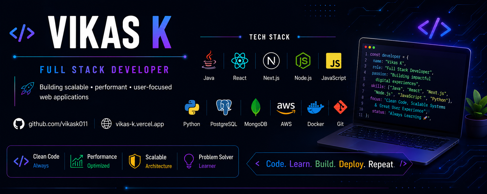

  

 

  

  
  
  

---

# 👨‍💻 About Me

I'm a **Full Stack Developer** passionate about building scalable web applications and solving real-world problems through software. I enjoy building production-ready applications, exploring AI systems, and contributing to open source.

- 💻 Building scalable full-stack applications
- ☕ Strong in Java, JavaScript, React, Next.js & Node.js
- 🤖 Exploring AI Agents, RAG Systems & LLM-powered applications
- ☁️ AWS • Docker • MongoDB • PostgreSQL
- 🧩 DSA • OOP • REST APIs • System Design
- 🚀 Always learning, building and shipping projects

---

# 🚀 Featured Projects

### 🤖 AI GitHub Agent

Autonomous multi-agent system built with **LangGraph** that researches GitHub repositories, generates fixes, validates them inside Docker, and creates pull requests with a human-in-the-loop approval workflow.

🔗 **GitHub:** https://github.com/vikask011/ai-github-agent

---

### 🩺 MediBook

Production-ready doctor appointment platform featuring patient, doctor and admin portals, AI health chatbot, secure JWT authentication, PostgreSQL on AWS RDS, AWS S3 and EC2 deployment.

🔗 **GitHub:** https://github.com/vikask011/medibook

---

### 💬 Realtime Chat

Scalable real-time chat application using Socket.IO and Redis Pub/Sub with MongoDB persistence, delivering reliable messaging and low-latency communication.

🔗 **GitHub:** https://github.com/vikask011/realtime-chat-redis

---

# 🌟 Open Source

### Social Summer of Code 2026 (SSoC)

- 💻 Contributed to projects including **DevConnect-AI**, **One-File-Tools**, **Product Store**, **PatchPilot**, **AgentWatch**, and **Open Source Contribution Atelier**.
- 🔧 Worked on authentication, AI integrations, dashboards, profile management, notifications, security fixes, UI/UX improvements, performance optimization, and developer tooling.

---

# 💻 Tech Stack

### Languages

### Frontend

### Backend

### Databases

### Cloud & DevOps

### Tools

---

# 📊 GitHub Stats

  

  

  

---

# 🏆 Competitive Programming

- 🟡 **LeetCode:** https://github.com/vikask011/leetcode
- 🟢 **GeeksforGeeks:** https://github.com/vikask011/gfg

---

# 🧠 Core Skills

`Java` • `JavaScript` • `React` • `Next.js` • `Node.js` • `Python` • `FastAPI` • `MongoDB` • `PostgreSQL` • `AWS` • `Docker` • `REST APIs` • `JWT` • `AI Agents` • `RAG` • `System Design` • `DSA`

---

  <b>⭐ Thanks for visiting my profile!</b>
    
  <i>"Code. Learn. Build. Repeat."</i>

